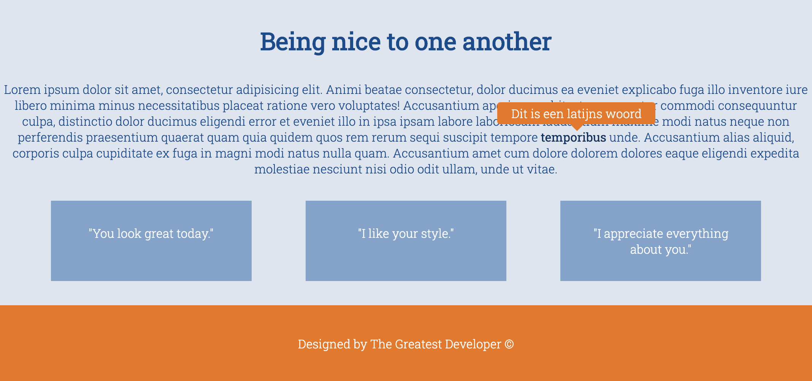

# Opdrachtbeschrijving

Tijd om te experimenteren met de kracht van pseudo-elementen. Je gaat onderstaande webpagina van een aantal handige trucjes voorzien:

Je kunt deze opdracht maken door het project te clonen of te downloaden naar jouw eigen computer via [deze](https://github.com/hogeschoolnovi/frontend-css-pseudo-tooltip) GitHub repository. De uitwerkingen staan op de branch *uitwerkingen*. Wanneer je liever handmatig een eigen project opzet, mag dit ook. Zorg dan dat je [deze](https://github.com/hogeschoolnovi/frontend-css-pseudo-tooltip/blob/master/index.html) HTML in jouw HTML-bestand plaatst en [deze]() stijlregels in jouw CSS-bestand.

Het project bevat de volgende bestanden:

- `index.html` met daarin de tekst en elementen die je zult gaan voorzien van styling;
- `styles.css`: dit bestand bevat een aantal stijlregels. Verander hier niets aan. Bovenaan het bestand kun jij jouw eigen CSS invoegen. 

Bestudeer eerst de opbouw van het HTML-document goed voordat je aan de slag gaat. Let op: Je mag niets veranderen in de HTML behalve het eventueel toevoegen van `class`- of `id`-attributen.

## Opdracht 1: symbolen bijvoegen
De maker van deze webpagina licht iedere maand andere inspirerende complimenten uit in de blauwe blokken op de homepagina. Deze quotes staan er nu _hardcoded_ in, maar zullen in de toekomst worden opgehaald uit een database. Om duidelijk te maken dat het om quotes gaat, plaatsen we er op de webpagina aanhalingstekens (`" "`) omheen. Deze tekens willen we echter niet hoeven opslaan in de database. Daarom voegen we deze speciale tekens in, doormiddel van pseudo-elementen.

### Aanhalingstekens
Zorg ervoor dat de `<article class="compliment">`-tags worden voorzien van aanhalingstekens, door gebruik te maken van een `before` en `after` pseudo-element. Gebruik voor de aanhalingstekens de juiste [content-code](https://css-tricks.com/snippets/html/glyphs/#aa-special-characters):

Bron: [CSS Tricks](https://css-tricks.com/snippets/html/glyphs/#aa-special-characters) 

### Copyright
Zorg ervoor dat de tekst in de footer word voorzien van een copyright-teken. Gebruik hier een pseudo-element voor. Ben je opzoek naar de content-code? Deze kun je [hier](https://css-tricks.com/snippets/html/glyphs/#aa-latin-1-entity-set-for-html) opzoeken.

## Opdracht 2: tooltip
Maak met behulp van pseudo-elementen een tooltip (een soort praatwolkje) met daarin de tekst `Dit is een latijns woord`. Deze tooltip moet precies in het midden van de ``-tag zweven. De tooltip mag alleen verschijnen als de gebruiker met de muis over het woord beweegt. Tip: zorg ervoor dat de tooltip ook in het midden van het woord zal blijven staan als het woord ineens twee keer zo lang blijkt te zijn, zoals `hottentottententententoonstelling`.
